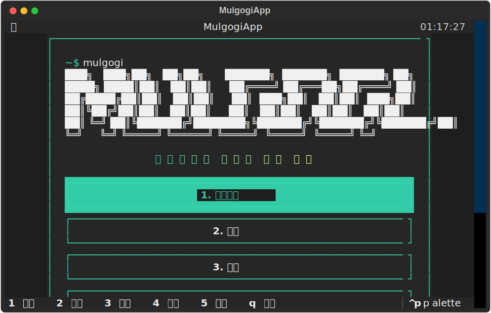
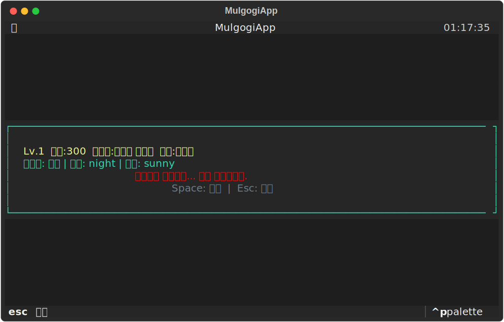
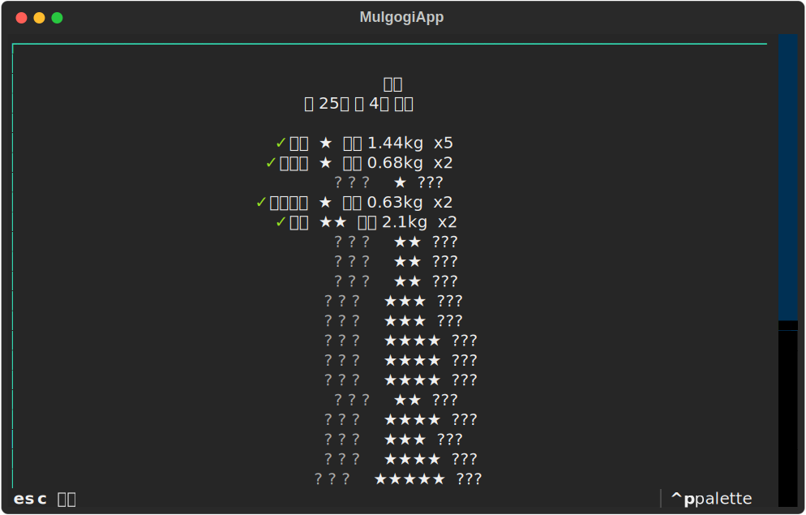
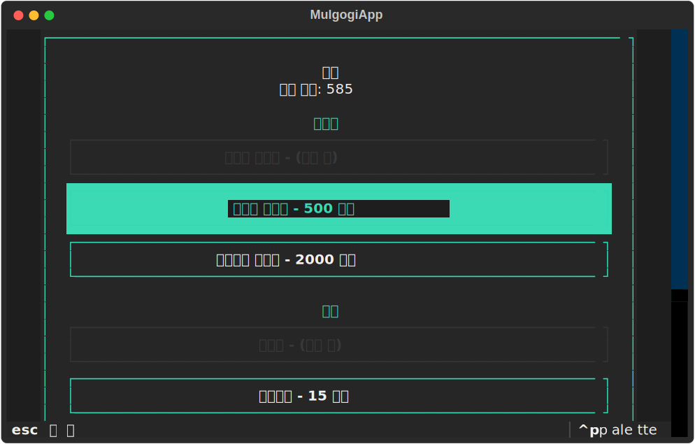

# 🎣 mulgogi

**터미널에서 즐기는 픽셀 아트 낚시 게임**

`mulgogi`는 Python + Textual로 만든 CLI 낚시 게입니다. 
방향키와 Space만으로 각도를 조절하고, 입질 타이밍을 맞춰 물고기를 잡으세요.

---

## 스크린샷

### 메인 메뉴


### 낚시 결과


### 도감


### 상점


---

## 설치

### pip（크로스 플랫포름）

```bash
pip install mulgogi
mulgogi
```

### Homebrew（macOS / Linux）

```bash
brew tap justart-dev/mulgogi
brew install justart-dev/mulgogi/mulgogi
mulgogi
```

### 소스 실행

```bash
git clone https://github.com/justart-dev/mulgogi.git
cd mulgogi
python3 -m mulgogi
```

---

## 조작법

| 키 | 동작 |
|---|---|
| `1` | 낚시하기 |
| `2` | 도감 |
| `3` | 상점 |
| `4` | 업적 |
| `5` | 통계 |
| `q` | 종료 |
| `←` / `→` | 각도 조절 |
| `Space` | 캐스트 / 입질 / 릴 멈춤 |
| `Esc` | 뒤로 |

---

## 기능

- **25종의 다양한 물고기** — 연못, 강, 호수, 바다에 생태를 바뀌며 사는 물고기들
- **픽셀 아트** — 종류별로 색감을 달리한 터미널 스프라이트
- **성장 시스템** — 레벨/경험치, 낚시터 해제, 낚싯대/미끼 구매
- **도감 & 업적** — 잡은 물고기를 모으고 칭호를 얻으세요
- **차콜 컬러 테마** — 차콜 배경에 민트 그린 악센트

---

## 기술 스택

- **Language:** Python 3.9+
- **TUI Framework:** [Textual](https://textual.textualize.io/)
- **배포:** Trusted Publishing(PyPI) + GitHub Releases + Homebrew tap

---

## 라이센스

MIT License
